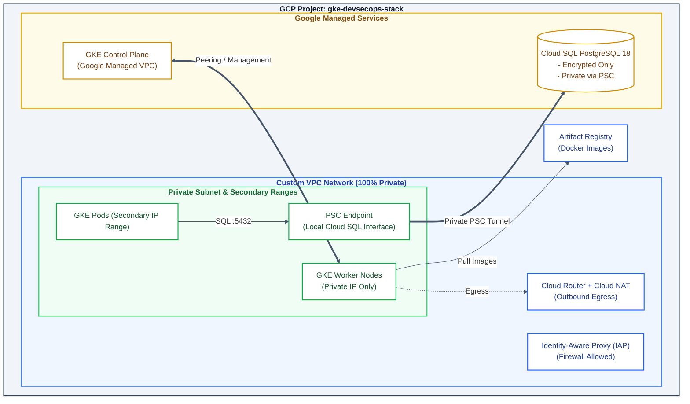

# [1/3] Cloud-Native Platform — GCP Infrastructure, Cloud SQL & Private GKE

[](https://cloud.google.com/)
[](https://www.terraform.io/)
[](https://kubernetes.io/)
[](https://www.postgresql.org/)
[](#security--zero-trust-posture)

> **Enterprise Cloud-Native Infrastructure:** A production-grade, fully automated Terraform deployment of a secure Google Kubernetes Engine (GKE) cluster, deeply integrated with a private Cloud SQL PostgreSQL database via Private Service Connect (PSC).

---

## Executive Summary

This repository provisions the foundational infrastructure (Project 1 of 3) for a modern Cloud-Native ecosystem on Google Cloud Platform. It focuses on modular Infrastructure as Code (IaC) to establish a highly secure, private-by-default environment ready to host microservices.

---

## Security & Zero-Trust Posture

* **100% Private Network:** The GKE cluster nodes and the Cloud SQL database have no public IP addresses.
* **Private Service Connect (PSC):** Database connectivity is handled internally via a local PSC Endpoint, eliminating the need for VPC Peering or public exposure.
* **Least Privilege IAM:** A dedicated Service Account is bound to the GKE nodes, preventing the use of the default Compute Engine service account.
* **Enforced Encryption:** Cloud SQL is strictly configured with `ssl_mode = "ENCRYPTED_ONLY"` to enforce TLS on all database connections.
* **IAP-Ready:** Network firewalls are configured to allow Identity-Aware Proxy (IAP) tunneling for secure, bastionless administration.

---

## Architecture Diagram



---

## Repository Structure

```text
.
├── main.tf                  # Infrastructure module invocations
├── outputs.tf               # Infrastructure deployment outputs
├── providers.tf             # Terraform provider definitions
├── terraform.tfvars.example # Input variables example template
├── variables.tf             # Core variable definitions
└── modules/
    ├── database/            # Cloud SQL PostgreSQL and PSC provisioning
    ├── gke/                 # Private Kubernetes Cluster
    ├── registry/            # Artifact Registry Docker repository
    ├── network/             # VPC, subnets, NAT, and secondary ranges
    └── security/            # IAM, Service Accounts & IAP Firewall
```

---

## Deployment Quickstart

### Prerequisites

* **Google Cloud SDK (`gcloud`)** installed and authenticated.
* **Terraform** `>= 1.5.0`

### 1. Configure Authentication & Variables

```bash
# Authenticate with GCP
gcloud auth login
gcloud auth application-default login

# Setup variables
cp terraform.tfvars.example terraform.tfvars
# Edit terraform.tfvars with your GCP project details
```

### 2. Provision Infrastructure

```bash
terraform init
terraform validate
terraform plan
terraform apply
```

### 3. Retrieve Credentials

Once deployed, retrieve your database credentials and cluster connection info:

```bash
# Get the auto-generated database password
terraform output -raw db_password

# Connect to the GKE cluster
gcloud container clusters get-credentials $(terraform output -raw cluster_name) \
    --region $(terraform output -raw region) \
    --project $(terraform output -raw project_id)
```

---

## Platform Ecosystem

This repository is **Part 1 of 3** in the Cloud-Native End-to-End Platform series:

1. **`01-platform-infra-terraform`** *(This repository)* — Provisioning base cloud infrastructure (VPC, GKE Private, Cloud SQL, Artifact Registry).
2. [**`02-platform-gitops-config`**](https://github.com/vladimir-evdokimov-pro/02-platform-gitops-config) — GitOps engine, Kubernetes controllers & cluster configuration (ArgoCD, Ingress, Cert-Manager).
3. [**`03-sample-app-microservice`**](https://github.com/vladimir-evdokimov-pro/03-sample-app-microservice) — Microservice application workloads and deployment manifests.