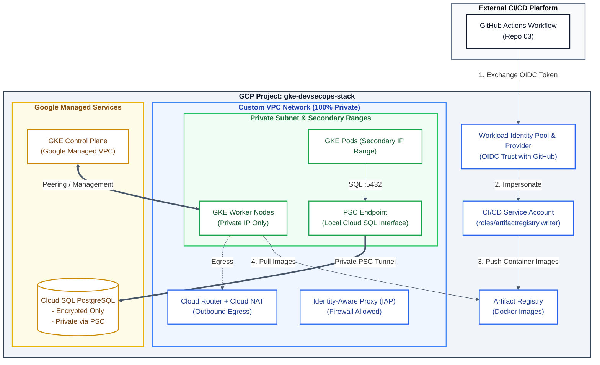

# [1/3] Cloud-Native Platform — GCP Infrastructure, Cloud SQL & Private GKE

[](https://cloud.google.com/)
[](https://www.terraform.io/)
[](https://kubernetes.io/)
[](https://www.postgresql.org/)
[](https://github.com/features/actions)
[](#security--zero-trust-posture)

> **Enterprise Cloud-Native Infrastructure:** A production-grade, fully automated Terraform deployment of a secure Google Kubernetes Engine (GKE) cluster, deeply integrated with a private Cloud SQL PostgreSQL database via Private Service Connect (PSC), and equipped with Workload Identity Federation (WIF) for keyless CI/CD authentication.

---

## Executive Summary

This repository provisions the foundational infrastructure (Project 1 of 3) for a modern Cloud-Native ecosystem on Google Cloud Platform. It focuses on modular Infrastructure as Code (IaC) to establish a highly secure, private-by-default environment ready to host microservices and automate container image publishing without static credentials.

---

## Security & Zero-Trust Posture

* **Keyless CI/CD Authentication (Workload Identity Federation):** OIDC-based federation with GitHub Actions eliminates long-lived Service Account JSON keys. Access is cryptographically scoped to the specific repository owner (`assertion.repository_owner`).
* **100% Private Network:** The GKE cluster nodes and the Cloud SQL database have no public IP addresses.
* **Private Service Connect (PSC):** Database connectivity is handled internally via a local PSC Endpoint, eliminating the need for VPC Peering or public exposure.
* **Least Privilege IAM:** Dedicated Service Accounts are assigned to GKE nodes (`roles/logging.logWriter`, `roles/monitoring.metricWriter`) and CI/CD (`roles/artifactregistry.writer`), avoiding default Compute Engine permissions.
* **Enforced Encryption:** Cloud SQL is strictly configured with `ssl_mode = "ENCRYPTED_ONLY"` to enforce TLS on all database connections.
* **IAP-Ready:** Network firewalls are configured to allow Identity-Aware Proxy (IAP) tunneling for secure, bastionless administration.

---

## Architecture Diagram



---

## Repository Structure

```text
.
├── .gitignore               # Strict exclusion patterns for secrets and state
├── main.tf                  # Root module invocations & platform assembly
├── outputs.tf               # Infrastructure deployment outputs
├── providers.tf             # Terraform provider configuration
├── terraform.tfvars.example # Example variable input values
├── variables.tf             # Core variable definitions
└── modules/
    ├── database/            # Cloud SQL PostgreSQL and PSC forwarding rule
    ├── gke/                 # Private GKE Cluster and dedicated Node Pool
    ├── iam/                 # Workload Identity Federation (WIF) & GitHub SA
    ├── network/             # Custom VPC, private subnets, Cloud Router & NAT
    ├── registry/            # Artifact Registry Docker repository
    └── security/            # GKE Node Service Account & IAP firewall rules
```

---

## Module Inventory & Inputs

| Module | Resource Provided | Key Security / Design Features |
| :--- | :--- | :--- |
| `network` | VPC, Subnet, Router, NAT | 100% private topology, NAT egress for updates. |
| `security` | Node SA, Firewall | Enforces least privilege, IAP access rule (35.235.240.0/20). |
| `database` | Cloud SQL, PSC Endpoint | Private Service Connect tunneling, encrypted-only TLS connections. |
| `gke` | Private GKE Cluster, Node Pool | Private nodes/endpoint, custom SA binding. |
| `registry` | Artifact Registry Repository | Private Docker format registry. |
| `iam` | WIF Pool, Provider & CI/CD SA | Keyless OIDC federation for GitHub Actions. |

---

## Deployment Quickstart

### Prerequisites

* **Google Cloud SDK (`gcloud`)** installed and authenticated.
* **Terraform** `>= 1.5.0`

### 1. Configure Authentication & Variables

```bash
# Authenticate with GCP
gcloud auth login
gcloud auth application-default login

# Initialize variable file
cp terraform.tfvars.example terraform.tfvars
```

Fill `terraform.tfvars` with your target environment details:

```hcl
project_id      = "gke-devsecops-stack-26"
region          = "europe-west9"
github_username = "your-github-username"
```

### 2. Provision Infrastructure

```bash
terraform init
terraform validate
terraform plan
terraform apply
```

### 3. Retrieve Cluster Credentials & CI/CD Variables

Upon successful completion, Terraform exposes the required platform endpoints and IAM credentials:

```bash
# Connect to the private GKE cluster
gcloud container clusters get-credentials $(terraform output -raw cluster_name) \
    --region europe-west9 \
    --project $(terraform output -raw project_id)

# Fetch Workload Identity outputs for CI/CD setup
terraform output gcp_workload_identity_provider
terraform output gcp_service_account_email
```

---

## CI/CD Pipeline Integration (Repo 03)

To allow repository **`03-sample-app-microservice`** to authenticate and push container images automatically via GitHub Actions:

1. Navigate to **`03-sample-app-microservice` > Settings > Secrets and variables > Actions > Variables**.
2. Add the following repository variables using the outputs from this deployment:

| GitHub Variable Name | Value Source (Terraform Output) |
| :--- | :--- |
| `GCP_WORKLOAD_IDENTITY_PROVIDER` | `gcp_workload_identity_provider` |
| `GCP_SERVICE_ACCOUNT` | `gcp_service_account_email` |

---

## Platform Ecosystem

This repository is **Part 1 of 3** in the Cloud-Native End-to-End Platform series:

1. **`01-platform-infra-terraform`** *(This repository)* — Provisioning base cloud infrastructure (VPC, GKE Private, Cloud SQL, Artifact Registry, Workload Identity Federation).
2. [**`02-platform-gitops-config`**](https://github.com/vladimir-evdokimov-pro/02-platform-gitops-config) — GitOps engine, Kubernetes controllers & cluster configuration (ArgoCD, Ingress, Cert-Manager).
3. [**`03-sample-app-microservice`**](https://github.com/vladimir-evdokimov-pro/03-sample-app-microservice) — Microservice application workloads and deployment manifests.